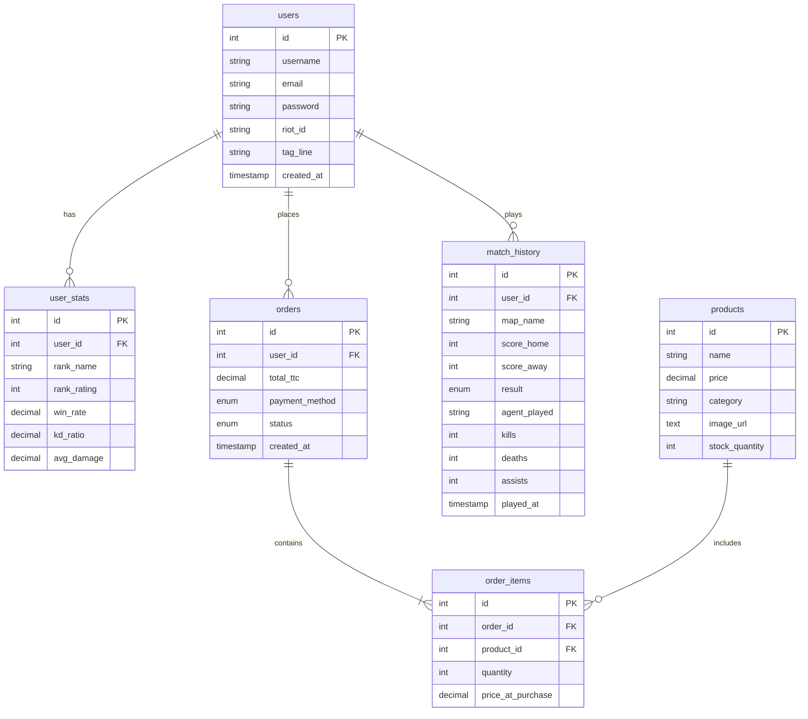

# 🎮 B3 Desktop - Plateforme E-Sport

<div align="center">


**Application desktop moderne pour la gestion de compétitions e-sport, statistiques de joueurs et boutique en ligne**

[Fonctionnalités](#-fonctionnalités) •
[Installation](#-installation) •
[Configuration](#️-configuration) •
[Utilisation](#-utilisation) •
[Architecture](#-architecture)

</div>

---

## 📋 Sommaire

- [À propos](#-à-propos)
- [Fonctionnalités](#-fonctionnalités)
- [Technologies](#-technologies)
- [Prérequis](#-prérequis)
- [Installation](#-installation)
- [Configuration](#️-configuration)
- [Utilisation](#-utilisation)
- [Structure du projet](#-structure-du-projet)
- [Base de données](#-base-de-données)
- [Contribuer](#-contribuer)
- [Licence](#-licence)

---

## 🎯 À propos

**B3 Desktop** est une application desktop cross-platform développée avec Electron et React, dédiée à la communauté e-sport. Elle offre une expérience complète pour les joueurs, permettant de suivre leurs statistiques, participer à des tournois, acheter du merchandising et gérer leur profil.

### Pourquoi ce projet ?

- 🏆 **Gestion de tournois** : Suivez les compétitions en temps réel
- 📊 **Statistiques détaillées** : Analysez vos performances de jeu
- 🛒 **Boutique intégrée** : Achetez des produits e-sport directement
- 👤 **Profil personnalisé** : Gérez votre identité de joueur
- 🔒 **Sécurisé** : Authentification robuste avec bcrypt

---

## ✨ Fonctionnalités

### 🔐 Authentification
- Inscription et connexion sécurisées
- Hashage des mots de passe avec bcrypt
- Gestion de session utilisateur
- Mise à jour du profil (username, email, Riot ID)

### 📊 Statistiques de joueur
- Suivi des matchs joués
- Ratio K/D (Kills/Deaths)
- Winrate et classement
- Statistiques par agent Valorant
- Historique détaillé des parties

### 🏆 Tournois
- Liste des tournois (à venir, en cours, terminés)
- Résultats des matchs en temps réel
- Simulation d'inscription aux tournois
- Visualisation des brackets
- Streaming de matchs intégré

### 🛒 Boutique E-Sport
- Catalogue de produits (maillots, sweats, accessoires)
- Panier d'achat avec gestion des quantités
- Système de codes promo (-5% à -20%)
- Gestion du stock en temps réel
- Historique des commandes

### 💳 Système de paiement
- Multiple moyens de paiement (Carte, PayPal, Crypto)
- Création de commandes avec transactions SQL
- Mise à jour automatique du stock
- Confirmation de commande

### 👤 Profil utilisateur
- Informations personnelles
- Statistiques globales
- Gestion du compte
- Modification du mot de passe

---

## 🛠 Technologies

### Frontend
- **Electron** 40.4.1 - Framework desktop cross-platform
- **React** 19.2.14 - Bibliothèque UI
- **TypeScript** 4.5.4 - Typage statique
- **TailwindCSS** 4.1.18 - Framework CSS utility-first
- **Framer Motion** - Animations fluides

### Backend
- **MySQL** 8.0 - Base de données relationnelle
- **mysql2** - Driver MySQL pour Node.js
- **bcryptjs** - Hashage de mots de passe
- **dotenv** - Gestion des variables d'environnement

### Build & Dev Tools
- **Vite** 5.4.21 - Build tool moderne
- **Electron Forge** 7.11.1 - Packaging et distribution
- **ESLint** - Linting du code
- **PostCSS** - Traitement CSS

---

## 📦 Prérequis

Avant de commencer, assurez-vous d'avoir installé :

- **Node.js** >= 18.0.0
- **npm** >= 9.0.0
- **MySQL** >= 8.0
- **Git**

Vérifiez vos versions :

```bash
node --version
npm --version
mysql --version
```

---

## 🚀 Installation

### 1. Cloner le repository

```bash
git clone https://github.com/amadoudiop04/B3-desktop-projet-electron.git
cd B3-desktop-projet-electron
```

### 2. Installer les dépendances

```bash
npm install
```

### 3. Créer le fichier de configuration

Créez un fichier `.env` à la racine du projet :

```bash
# Windows
New-Item .env

# Linux/Mac
touch .env
```

### 4. Configurer les variables d'environnement

Modifiez le fichier `.env` avec vos informations MySQL :

```env
DB_HOST=localhost
DB_PORT=3306
DB_NAME=desktop_projet
DB_USER=root
DB_PASSWORD=votre_mot_de_passe
```

---

## ⚙️ Configuration

### Base de données MySQL

#### 1. Créer la base de données

```sql
CREATE DATABASE desktop_projet CHARACTER SET utf8mb4 COLLATE utf8mb4_unicode_ci;
USE desktop_projet;
```

#### 2. Créer les tables

```sql
-- Table des utilisateurs
CREATE TABLE users (
    id INT AUTO_INCREMENT PRIMARY KEY,
    username VARCHAR(255) NOT NULL UNIQUE,
    email VARCHAR(255) NOT NULL UNIQUE,
    password VARCHAR(255) NOT NULL,
    riot_id VARCHAR(100),
    tag_line VARCHAR(50),
    created_at TIMESTAMP DEFAULT CURRENT_TIMESTAMP,
    updated_at TIMESTAMP DEFAULT CURRENT_TIMESTAMP ON UPDATE CURRENT_TIMESTAMP
);

-- Table des statistiques
CREATE TABLE user_stats (
    id INT AUTO_INCREMENT PRIMARY KEY,
    user_id INT NOT NULL,
    rank_name VARCHAR(50),
    rank_rating INT DEFAULT 0,
    win_rate DECIMAL(5,2) DEFAULT 0.00,
    kd_ratio DECIMAL(5,2) DEFAULT 0.00,
    avg_damage DECIMAL(10,2) DEFAULT 0.00,
    updated_at TIMESTAMP DEFAULT CURRENT_TIMESTAMP ON UPDATE CURRENT_TIMESTAMP,
    FOREIGN KEY (user_id) REFERENCES users(id) ON DELETE CASCADE
);

-- Table des produits
CREATE TABLE products (
    id INT AUTO_INCREMENT PRIMARY KEY,
    name VARCHAR(255) NOT NULL,
    price DECIMAL(10,2) NOT NULL,
    category VARCHAR(100),
    image_url TEXT,
    stock_quantity INT DEFAULT 0,
    created_at TIMESTAMP DEFAULT CURRENT_TIMESTAMP
);

-- Table des commandes
CREATE TABLE orders (
    id INT AUTO_INCREMENT PRIMARY KEY,
    user_id INT NOT NULL,
    total_ttc DECIMAL(10,2) NOT NULL,
    payment_method ENUM('Card', 'PayPal', 'Crypto') NOT NULL,
    status ENUM('Pending', 'Paid', 'Shipped') DEFAULT 'Pending',
    created_at TIMESTAMP DEFAULT CURRENT_TIMESTAMP,
    FOREIGN KEY (user_id) REFERENCES users(id) ON DELETE CASCADE
);

-- Table des articles de commande
CREATE TABLE order_items (
    id INT AUTO_INCREMENT PRIMARY KEY,
    order_id INT NOT NULL,
    product_id INT NOT NULL,
    quantity INT NOT NULL,
    price_at_purchase DECIMAL(10,2) NOT NULL,
    FOREIGN KEY (order_id) REFERENCES orders(id) ON DELETE CASCADE,
    FOREIGN KEY (product_id) REFERENCES products(id)
);

-- Table de l'historique des matchs
CREATE TABLE match_history (
    id INT AUTO_INCREMENT PRIMARY KEY,
    user_id INT NOT NULL,
    map_name VARCHAR(100) NOT NULL,
    score_home INT NOT NULL,
    score_away INT NOT NULL,
    result ENUM('W', 'L', 'win', 'loss') NOT NULL,
    agent_played VARCHAR(50) NOT NULL,
    kills INT DEFAULT 0,
    deaths INT DEFAULT 0,
    assists INT DEFAULT 0,
    played_at TIMESTAMP DEFAULT CURRENT_TIMESTAMP,
    FOREIGN KEY (user_id) REFERENCES users(id) ON DELETE CASCADE
);
```

#### 3. Insérer des données de test

```sql
-- Produits de test
INSERT INTO products (name, price, category, image_url, stock_quantity) VALUES
('Maillot Valorant Champions', 59.99, 'MAILLOTS', 'https://example.com/jersey.jpg', 50),
('Sweat à capuche TenZ', 79.99, 'SWEATS', 'https://example.com/hoodie.jpg', 30),
('Casquette Sentinels', 29.99, 'ACCESSOIRES', 'https://example.com/cap.jpg', 100);

-- Utilisateurs de test
INSERT INTO users (username, email, password) VALUES
('ProGamer', 'gamer@test.com', '$2b$10$YourHashedPassword'),
('Ninja', 'ninja@test.com', '$2b$10$YourHashedPassword');

-- Matchs de test
INSERT INTO match_history (user_id, map_name, score_home, score_away, result, agent_played, kills, deaths, assists, played_at) VALUES
(1, 'Haven', 13, 11, 'W', 'Jett', 28, 15, 4, NOW() - INTERVAL 1 HOUR),
(1, 'Bind', 10, 13, 'L', 'Phoenix', 18, 21, 7, NOW() - INTERVAL 2 HOUR);
```

---

## 💻 Utilisation

### Démarrer l'application en mode développement

```bash
npm start
```

L'application se lancera automatiquement avec :
- Hot reload activé
- DevTools ouverts
- Connexion à la base de données

### Commandes disponibles

```bash
# Démarrer en mode développement
npm start

# Linter le code
npm run lint

# Packager l'application
npm run package

# Créer un installateur
npm run make

# Publier l'application
npm run publish
```

### Navigation dans l'application

1. **Page d'accueil** 🏠
   - Vue d'ensemble des fonctionnalités
   - Accès rapide aux sections

2. **Statistiques** 📊
   - Consultez vos stats de jeu
   - Classement global

3. **Tournois** 🏆
   - Matchs récents
   - Inscription aux compétitions

4. **Boutique** 🛒
   - Parcourez les produits
   - Ajoutez au panier

5. **Panier** 🛍️
   - Gérez vos articles
   - Appliquez des codes promo

6. **Profil** 👤
   - Modifiez vos informations
   - Changez votre mot de passe

---

## 📁 Structure du projet

```
B3-desktop-projet-electron/
├── src/
│   ├── components/          # Composants React réutilisables
│   │   ├── Avatar.tsx
│   │   ├── CompetitionCard.tsx
│   │   ├── Footer.tsx
│   │   ├── Header.tsx
│   │   ├── Navigation.tsx
│   │   └── ...
│   │
│   ├── contexts/            # Contextes React
│   │   └── AuthContext.tsx  # Gestion de l'authentification
│   │
│   ├── database/            # Services de base de données
│   │   ├── connection.ts    # Pool MySQL
│   │   ├── userService.ts   # CRUD utilisateurs
│   │   ├── statsService.ts  # Stats de joueurs
│   │   ├── productService.ts # Produits
│   │   ├── orderService.ts  # Commandes
│   │   └── matchService.ts  # Matchs
│   │
│   ├── middleware/          # Middleware et guards
│   │   └── AuthPage.tsx     # Protection des routes
│   │
│   ├── pages/               # Pages de l'application
│   │   ├── HomePage.tsx
│   │   ├── LoginForm.tsx
│   │   ├── RegisterForm.tsx
│   │   ├── ProfilePage.tsx
│   │   ├── statsPage.tsx
│   │   ├── TournamentPage.tsx
│   │   ├── Shop.tsx
│   │   ├── PanierPage.tsx
│   │   └── PaymentPage.tsx
│   │
│   ├── types/               # Définitions TypeScript
│   │   └── electron.d.ts    # Types pour l'API Electron
│   │
│   ├── App.tsx              # Composant principal
│   ├── main.ts              # Process principal Electron
│   ├── preload.ts           # Script de préchargement
│   └── index.css            # Styles globaux
│
├── forge.config.ts          # Configuration Electron Forge
├── vite.main.config.ts      # Config Vite (main process)
├── vite.renderer.config.mjs # Config Vite (renderer)
├── tsconfig.json            # Configuration TypeScript
├── tailwind.config.js       # Configuration Tailwind
├── .env                     # Variables d'environnement
├── package.json             # Dépendances npm
└── README.md                # Documentation

```

---

## 🗄️ Base de données

### Schéma de la base de données



### Relations

- Un **utilisateur** peut avoir plusieurs **statistiques**, **commandes** et **matchs**
- Une **commande** contient plusieurs **articles**
- Un **produit** peut être dans plusieurs **commandes**

---

## 🔧 Fonctionnalités techniques

### Architecture IPC (Inter-Process Communication)

Communication sécurisée entre le process principal et le renderer :

```typescript
// Main Process (main.ts)
ipcMain.handle('auth:login', async (_, email, password) => {
  const user = await authenticateUser(email, password);
  return { success: true, user };
});

// Preload Script (preload.ts)
contextBridge.exposeInMainWorld('electronAPI', {
  login: (email, password) => ipcRenderer.invoke('auth:login', email, password)
});

// Renderer Process (React)
const result = await window.electronAPI.login(email, password);
```

### Gestion des transactions SQL

```typescript
const connection = await pool.getConnection();
await connection.beginTransaction();

try {
  // Créer la commande
  await connection.query('INSERT INTO orders...');
  // Insérer les articles
  await connection.query('INSERT INTO order_items...');
  // Décrémenter le stock
  await connection.query('UPDATE products...');
  
  await connection.commit();
} catch (error) {
  await connection.rollback();
  throw error;
}
```

### Sécurité

- ✅ Hashage des mots de passe (bcrypt, 10 rounds)
- ✅ Context isolation activée
- ✅ Node integration désactivée
- ✅ Requêtes SQL préparées (protection SQL injection)
- ✅ Validation des entrées utilisateur

---

## 🎨 Design System

### Palette de couleurs

- **Primaire** : `#3B82F6` (Bleu)
- **Secondaire** : `#8B5CF6` (Violet)
- **Succès** : `#10B981` (Vert)
- **Erreur** : `#EF4444` (Rouge)
- **Background** : `#0a1628` (Bleu foncé)
- **Surface** : `#111e31` (Gris bleuté)

### Composants

- Cartes avec hover effects
- Animations Framer Motion
- Gradients modernes
- Responsive design

---

## 🚧 Roadmap

### Version 1.1 (En cours)
- [ ] Système de chat en temps réel
- [ ] Notifications push
- [ ] Mode sombre/clair
- [ ] Support multi-langues

### Version 2.0 (Planifié)
- [ ] Intégration API Riot Games
- [ ] Streaming Twitch intégré
- [ ] Système de classement ELO
- [ ] Matchmaking automatique

---

## 🤝 Contribuer

Les contributions sont les bienvenues ! Voici comment participer :

1. **Forkez** le projet
2. **Créez** une branche pour votre feature (`git checkout -b feature/AmazingFeature`)
3. **Committez** vos changements (`git commit -m 'Add AmazingFeature'`)
4. **Pushez** vers la branche (`git push origin feature/AmazingFeature`)
5. **Ouvrez** une Pull Request

### Guidelines

- Suivez les conventions de code TypeScript
- Ajoutez des tests pour les nouvelles fonctionnalités
- Mettez à jour la documentation si nécessaire
- Respectez le style de code existant (ESLint)

---

## 📝 Licence

Ce projet est sous licence **MIT**. Voir le fichier [LICENSE](LICENSE) pour plus de détails.

```
MIT License

Copyright (c) 2026 AMADOU

Permission is hereby granted, free of charge, to any person obtaining a copy
of this software and associated documentation files (the "Software"), to deal
in the Software without restriction, including without limitation the rights
to use, copy, modify, merge, publish, distribute, sublicense, and/or sell
copies of the Software, and to permit persons to whom the Software is
furnished to do so, subject to the following conditions:
...
```

---

## 👨‍💻 Auteur

**AMADOU**
- GitHub: [@amadoudiop04](https://github.com/amadoudiop04)
- Email: 147598248+amadoudiop04@users.noreply.github.com

---

## 🙏 Remerciements

- [Electron](https://www.electronjs.org/) - Framework desktop
- [React](https://react.dev/) - Bibliothèque UI
- [TailwindCSS](https://tailwindcss.com/) - Framework CSS
- [Vite](https://vite.dev/) - Build tool
- [MySQL](https://www.mysql.com/) - Base de données
- [Framer Motion](https://www.framer.com/motion/) - Animations

---

## 📞 Support

Si vous avez des questions ou rencontrez des problèmes :

1. Consultez la [documentation](#-sommaire)
2. Ouvrez une [issue](https://github.com/amadoudiop04/B3-desktop-projet-electron/issues)
3. Contactez-moi par email

---

<div align="center">

**⭐ Si ce projet vous a aidé, n'hésitez pas à lui donner une étoile ! ⭐**

Made with ❤️ by AMADOU

</div>